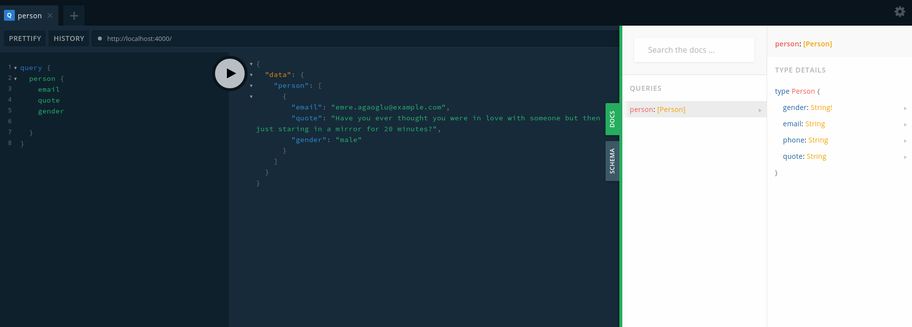

# Consume API with GraphQL
> This code helps to understand how to consume data from Rest API using _GraphQL_.

## Technologies
- [GraphQL](https://graphql.org/)
- [Apollo-Server](https://www.apollographql.com/docs/apollo-server/)
- [RESTDataSource](https://www.apollographql.com/docs/apollo-server/data/data-sources/)
- [Typescript](https://www.typescriptlang.org/)

## Public APIs
- https://api.randomuser.me/
- https://api.randomuser.me/

## How to use
```
git clone https://github.com/IgoMedeiros/apolloserve-consume-rest.git

cd apolloserve-consume-rest

npm install

npm run dev
```

Now, It's possible to use [_playground_](https://www.apollographql.com/docs/apollo-server/testing/graphql-playground/) on `http://localhost:4000` to test backend.


